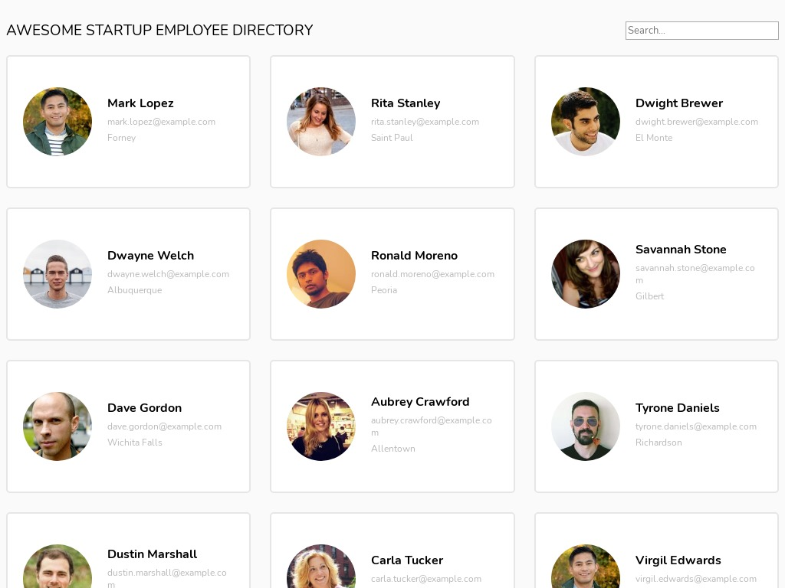

# Awesome Startup Employee Directory

## Background

I learned how to use vanilla JS to create many components, display them on the page and with a modal window, and communicate with an API for data.

## Technologies

This project was created with:

- JavaScript
- CSS
- The [Random User Generator API](https://randomuser.me)
